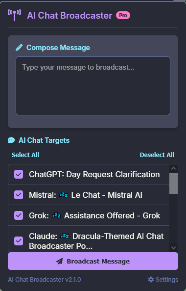

<div align="center">

# 🔊 AI Chat Broadcaster

[](https://github.com/yourusername/ai-chat-broadcaster/releases)
[](LICENSE)
[](https://addons.mozilla.org/)
[](https://github.com/yourusername/ai-chat-broadcaster/pulls)

<p align="center">
  
</p>

**Send messages to multiple AI assistants simultaneously**

[Features](#-features) • 
[Supported Platforms](#-supported-platforms) • 
[Installation](#-installation) • 
[Usage](#-usage) • 
[Screenshots](#-screenshots) • 
[Documentation](#-documentation) • 
[Contributing](#-contributing) • 
[License](#-license)

</div>

## ✨ Features

<table>
  <tr>
    <td width="50%">
      <h3>Multi-platform Broadcasting</h3>
      <p>Send the same prompt to multiple AI assistants with one click, saving time and ensuring consistent responses</p>
    </td>
    <td width="50%">
      <h3>Selective Sending</h3>
      <p>Choose which AI chats receive your message with simple checkboxes for maximum flexibility</p>
    </td>
  </tr>
  <tr>
    <td width="50%">
      <h3>Status Feedback</h3>
      <p>Get clear feedback on message delivery success with visual indicators for each chat</p>
    </td>
    <td width="50%">
      <h3>Multilingual Support</h3>
      <p>Available in English and Ukrainian with an easy language switcher</p>
    </td>
  </tr>
</table>

## 🤖 Supported Platforms

| Platform | Status | Website | Notes |
|----------|--------|---------|-------|
|  | ✅ Active | [chat.openai.com](https://chat.openai.com) | Full support for free and Plus accounts |
|  | ✅ Active | [claude.ai](https://claude.ai) | Works with all Claude models |
|  | ✅ Active | [grok.com](https://grok.com) | Supports X Premium subscribers |
|  | ✅ Active | [chat.deepseek.com](https://chat.deepseek.com) | Compatible with all models |
|  | ✅ Active | [chat.mistral.ai](https://chat.mistral.ai) | Works with free and paid tiers |

## 📥 Installation

<details>
<summary><b>Firefox Browser</b></summary>

1. Download the latest release from the [Releases page](https://github.com/yourusername/ai-chat-broadcaster/releases)
2. Open Firefox and navigate to `about:addons`
3. Click the gear icon and select "Install Add-on From File..."
4. Select the downloaded `.xpi` file
5. Grant the necessary permissions when prompted
</details>

<details>
<summary><b>Development Build</b></summary>

```bash
# Clone the repository
git clone https://github.com/yourusername/ai-chat-broadcaster.git

# Navigate to the directory
cd ai-chat-broadcaster

# Install web-ext (if not already installed)
npm install --global web-ext

# Run the extension in Firefox
web-ext run
```
</details>

## 🚀 Usage

<p align="center">
  
</p>

<details>
<summary><b>Step-by-step guide</b></summary>

1. **Open AI Chats**: Log into your accounts on supported platforms and open them in separate tabs
2. **Click the Extension Icon**: Click on the AI Chat Broadcaster icon in your browser toolbar
3. **Enter Your Message**: Type the text you want to send to all chats
4. **Select Chats**: Check the AI chats you want to send your message to
5. **Send**: Click the "Send to all selected chats" button
</details>

### 💡 Pro Tips

- For complex prompts, prepare your text in a text editor first
- Use the "Select All" button to quickly check all open chats
- Monitor the status messages to ensure successful delivery

## 📸 Screenshots

<div align="center">
  
</div>

## 📚 Documentation

### Architecture

The extension is built using standard web technologies and follows a modular architecture:

```
AI Chat Broadcaster/
├── manifest.json     # Extension configuration
├── background.js     # Background script for tab management
├── content.js        # Content script for chat interaction
├── popup.html/js     # User interface
├── welcome-*.html    # Onboarding pages
└── icons/            # Extension icons
```

### Technical Implementation

- **JavaScript**: Core functionality for message broadcasting
- **HTML/CSS**: User interface with responsive design
- **Browser Extension API**: For cross-tab communication and content script injection

#### Key Components

- **content.js**: Handles message injection into different chat interfaces
- **background.js**: Manages tab communication and diagnostics
- **popup.html/js**: Provides the user control panel

## 🤝 Contributing

Contributions are welcome! Please feel free to submit a Pull Request.

1. Fork the repository
2. Create your feature branch (`git checkout -b feature/amazing-feature`)
3. Commit your changes (`git commit -m 'Add some amazing feature'`)
4. Push to the branch (`git push origin feature/amazing-feature`)
5. Open a Pull Request

## 📝 License

This project is licensed under the MIT License - see the [LICENSE](LICENSE) file for details.

## 🙏 Acknowledgements

- Icons from [Font Awesome](https://fontawesome.com)
- UI design inspired by [Dracula Theme](https://draculatheme.com)
- Special thanks to all contributors

---

<div align="center">
  <sub>Built with ❤️ by <a href="https://github.com/ruslanlap">ruslanlap</a></sub>
</div>
